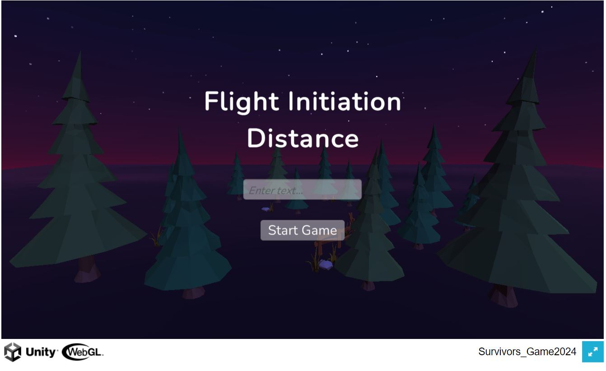
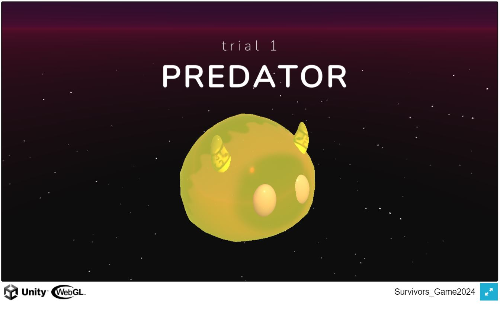
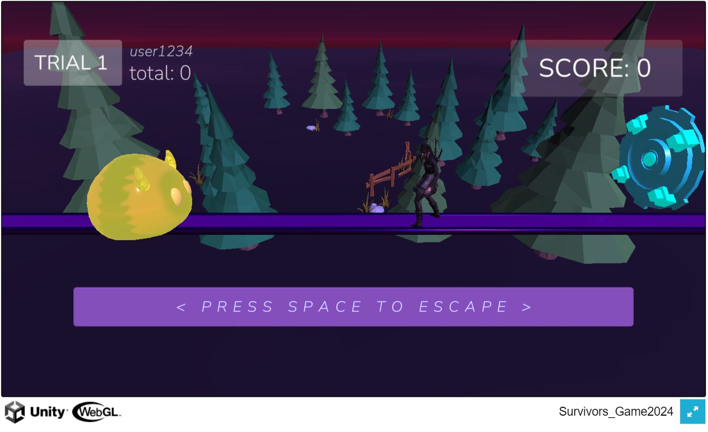
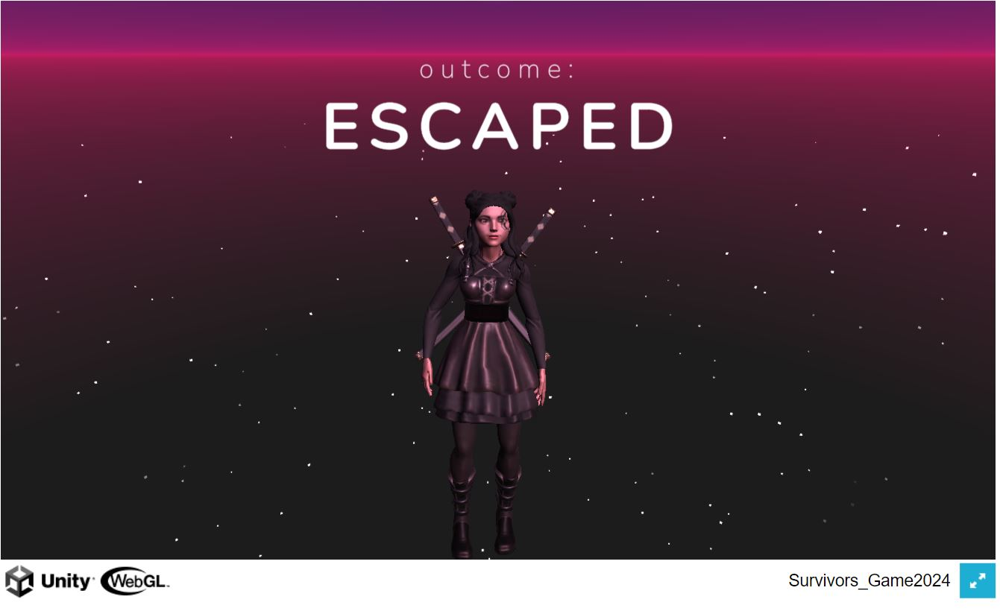
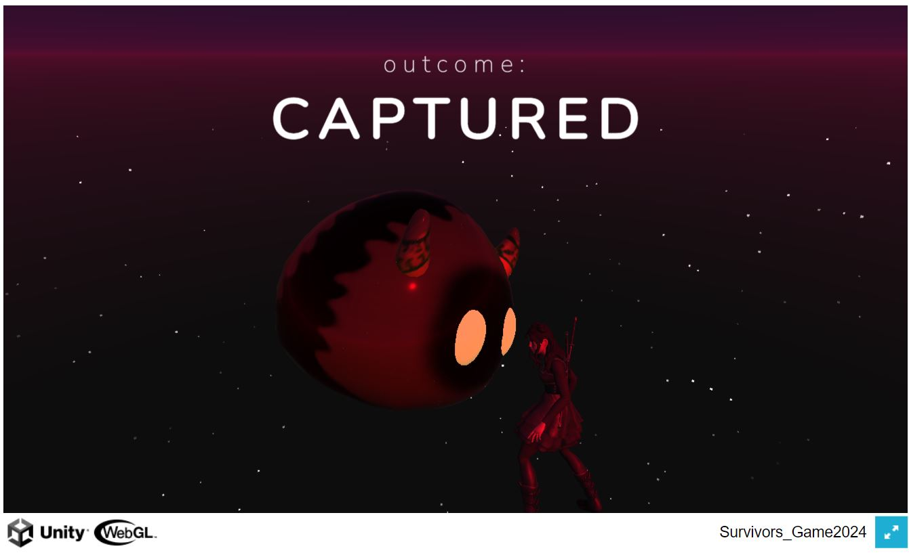

# fid-webgl-build
*WebGL Build for Flight Initiation Distance Game*

# Game Objective
The objective of the game is for the player to escape a predator by pressing a button at the right moment. After pressing the button, the player begins to move towards an "escape" portal. If the player manages to reach the escape before the predator catches them, points are awarded based on how long the player waited before starting to escape. If the player is caught, no points are awarded. The premise of the game is based on the player finding the optimal amount of time to wait that will maximize their score without being caught by the predator. Points increase linearly with time spent before the player chooses to escape, and points from completed trials are added up to calculate the player's total score.

The predator begins chasing the player at the beginning of the trial, and will begin "attacking" after some unknown amount of time. When the predator begins attacking, the predator speed increases and the player can no longer press a button to escape. There are three types of predators of increasing difficulty that are color-coded to indicate which type they are.

# How To Play
The first screen the user is presented with is the login screen:

You can click the two diagonal arrows in the bottom right hand corner to enter fullscreen, and the ESC key to exit fullscreen. Enter your player PID or username into the text entry box and then click "Start Game" to proceed.

The next screen shows the trial number and the predator type. Light yellow is the easiest difficulty, orange is harder, and dark red is the hardest difficulty level. After this screen, the game environment is shown and the player, predator, and escape zone are spawned in.

The trial begins! The predator will begin moving towards the player at a constant speed, and you can click the SPACE bar at any time (before the predator speeds up and begins attacking) to begin running towards the escape portal. Staying stationary longer before beginning to escape will result in more points, but getting caught results in zero points.

The next screen shows the trial outcome-- whether the player escaped or was captured. The next screen then shows the trial number for the next trial and the predator type, and the process repeats again. The score awarded in the previous trial has been added to the total score and is visible on the top left. This demonstration includes 10 trials total.
